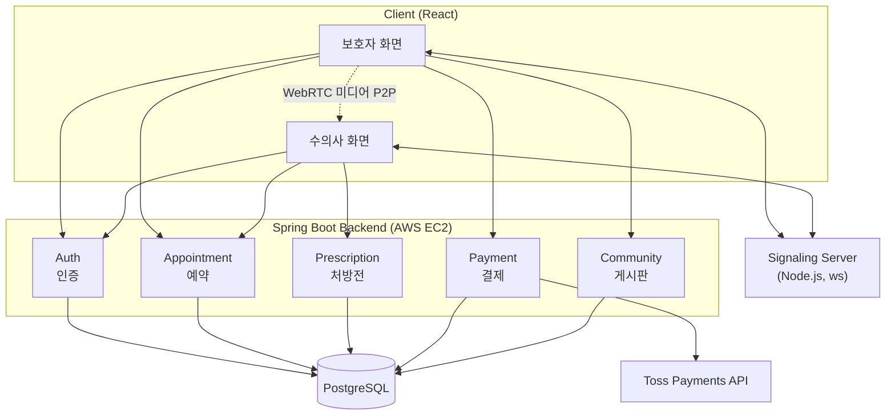
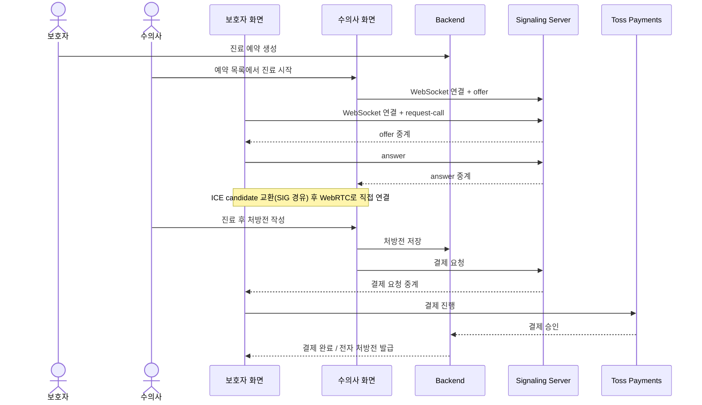

# 멍냥케어 — 반려동물 비대면 진료 서비스 (Backend)

반려동물 보호자가 예약 후 수의사와 화상으로 비대면 진료를 받는 서비스 "멍냥케어"의 백엔드입니다. 예약, 화상 진료, 처방전 발급, 결제, 커뮤니티 게시판 기능을 제공합니다.

> 팀 프로젝트로 진행했습니다 (2025.04–12, 총 4명 참여). PL(프로젝트 리더)을 맡아 예약·처방전·결제·커뮤니티·인증 등 백엔드 전체를 직접 설계·개발했습니다.

## 담당 역할

- PL(프로젝트 리더)로 프로젝트 전체 진행 총괄
- 예약·처방전·결제·커뮤니티·인증 등 5개 도메인 백엔드 개발
- 프로젝트 막바지 AWS EC2 배포 단독 진행

## 시스템 구성도

## 전체 흐름도

예약부터 화상 진료, 결제까지 이어지는 핵심 플로우입니다.

> Backend 저장소: [petcare-backend](https://github.com/JOOON9286/petcare-backend) · Frontend 저장소: [petcare-frontend](https://github.com/JOOON9286/petcare-frontend) · 시그널링 서버(Node.js): [petcare-signaling-server](https://github.com/JOOON9286/petcare-signaling-server)

## 주요 기능

- **예약(Appointment)**: 날짜·시간 선택, 반려동물 정보, 수의사 선택을 포함한 예약 플로우 API
- **처방전(Prescription)**: 진료 후 처방전 작성·조회 API
- **결제(Payment)**: 진료 결제 처리 API
- **커뮤니티(CommunityPost/Comment)**: 게시글·댓글 API
- **회원(User) 및 인증(Auth)**: 로그인/회원가입, JWT 기반 인증

## 기술 스택

- Java, Spring Boot, Spring Data JPA, Spring Security, JWT
- PostgreSQL
- AWS EC2

## 배포

AWS EC2 — 프로젝트 막바지(2025.12) 본인이 단독으로 배포 진행
